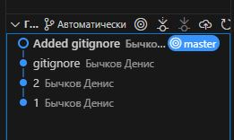

Системы контроля версий» - «Бычков Денис Вячеславович»      
    
--- 

### Задание 1
Зарегистрируйте аккаунт на https://github.com/. Если предпочитаете другое хранилище для репозитория, можно использовать его.

Создайте публичный репозиторий, который будете использовать дальше на протяжении всего курса, желательное с названием devops-netology. Обязательно поставьте галочку Initialize this repository with a README.

