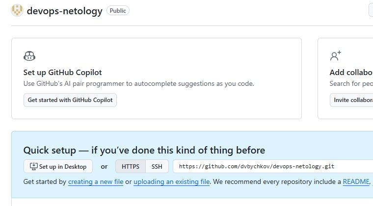
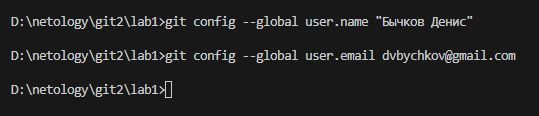
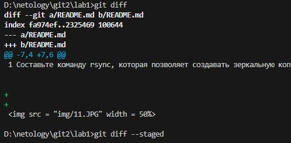
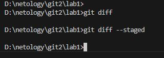
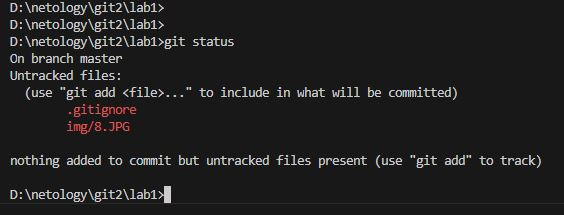
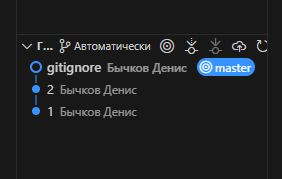
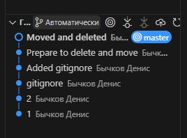
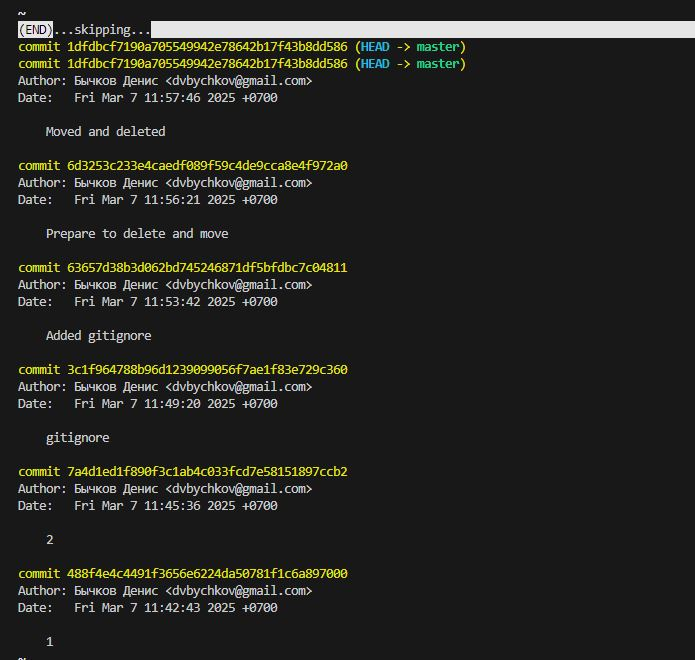
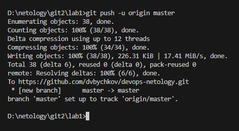

Системы контроля версий» - «Бычков Денис Вячеславович»      
    
--- 

Директории .terraform: Все файлы и подкаталоги внутри каталога .terraform будут проигнорированы. Это включает в себя временные файлы и кэш, которые Terraform создает для работы.

Файлы .tfstate: Все файлы с расширением .tfstate и .tfstate.* игнорируются. Эти файлы содержат состояние вашей инфраструктуры и ответственны за отслеживание ресурсов. Хранение их в репозитории может привести к утечке конфиденциальной информации.

Логи ошибок: Файлы crash.log и любые файлы, начинающиеся на crash., также будут проигнорированы. Эти файлы создаются в случае сбоя Terraform и не должны быть частью контроля версий.

Файлы .tfvars: Все файлы с расширением .tfvars и .tfvars.json проигнорируются. Эти файлы часто содержат переменные, которые могут содержать конфиденциальные данные, такие как пароли и ключи.

Файлы переопределения: Файлы, которые начинаются с override и имеют такие расширения, как .tf или .json, также проигнорированы. Эти файлы обычно используются для локальных изменений ресурсов.

Локальные файлы блокировок: Файл .terraform.tfstate.lock.info будет игнорирован. Этот файл используется для управления процессами блокировки при выполнении команды terraform apply.

Конфигурационные файлы CLI: Файлы .terraformrc и terraform.rc, которые используются для настройки Terraform на уровне клиента, также будут исключены.
В результате, данный .gitignore гарантирует, что чувствительные данные и временные файлы не будут случайно добавлены в репозиторий, что обеспечивает безопасность и чистоту вашего контроля версий.

